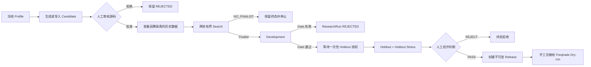
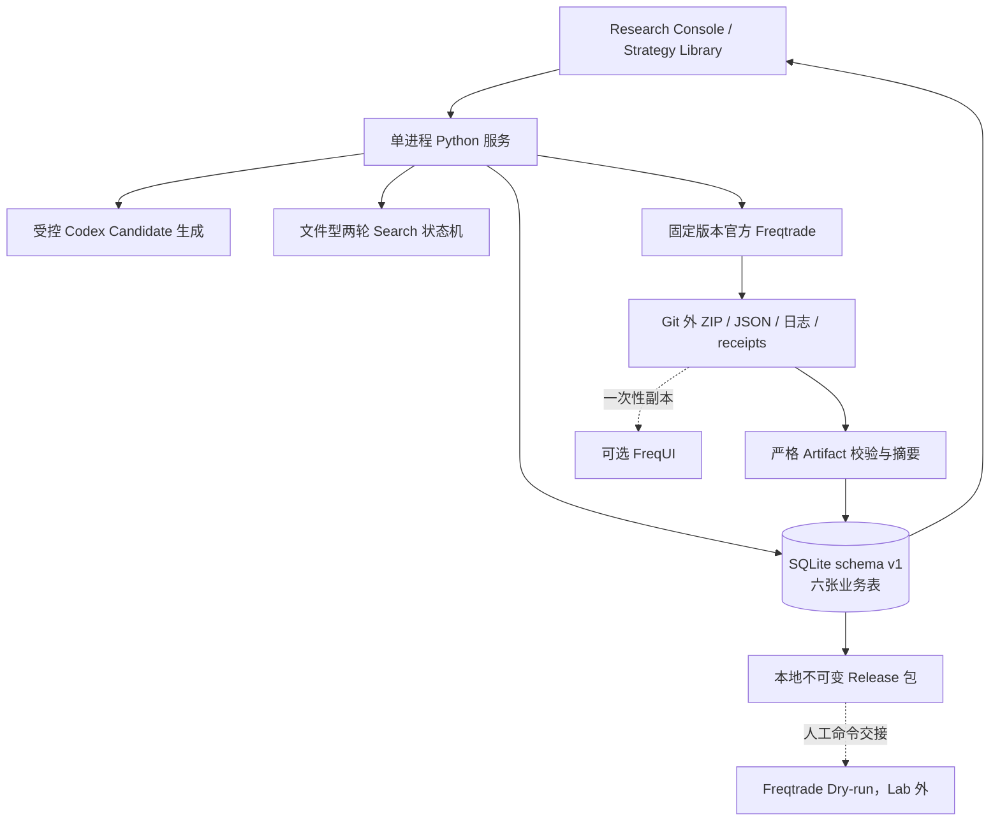

# freqtrade-lab 产品需求文档（个人策略研究 V1）

> 文档状态：V1 产品基线草案
> 面向读者：产品经理、项目所有者、研究执行者、后续开发者
> 当前状态快照：2026-09-04
> 代码基线：远端 `main` / `cf33eb9ad65020c181bb123d0c6937a713499f53`
> 最新交付范围：[Issue #43 PROFILE_DRIVEN_EXECUTION_V1](https://github.com/He1met/freqtrade-lab/issues/43)（已关闭）

阅读建议：产品经理第一次阅读建议依次看第 0、2、3、5、9、14、15、18 章；第 6–8、10–12、17 章是供研发和验收使用的详细合同，不要求一次读完。

## 0. 一页结论

`freqtrade-lab` 是一个个人、本地优先的 Freqtrade 策略研究工作台。它的核心价值不是“自动制造赚钱策略”，而是把一个策略从想法、候选、历史筛选、开发验证、未见数据验证、人工判断到 Release 的证据链保存完整，并在任何数据、配置、因果关系或身份不一致时停止。

项目应被理解为：

- Freqtrade 的研究控制层和证据管理层；
- 个人研究者的本地工作台；
- 一个受控、可追溯、允许得到负结果的实验闭环；
- 不是新的回测引擎、交易所客户端或自动交易平台。

截至本文件日期，项目的代码基础已经覆盖六表 SQLite、Artifact 导入、Strategy Library、Research Console、Codex Candidate、两轮 Search、Development、一次性 Holdout/Stress、人工 Judge 和本地 Release。Issue #43 的 1d Profile-driven 两轮历史 Search 已真实完成并冻结一个 Search finalist，但该 finalist 的净收益接近零、持有期为零且集中度为 100%；它尚未经过 Development，更没有打开 Holdout/Stress，因此不能称为合格、稳健或可交易策略。

V1 的最终用户结果是：

> 用户在同一个本地服务提供的一套页面中选择已经冻结的 Profile 和 Candidate，系统使用公开历史数据与官方 Freqtrade 完成受控研究，保存可追溯证据；只有依次通过 Search、Development、未见 Holdout/Stress 和人工判断的策略，才生成不可变 Release 包。任何阶段失败都保留真实终态，不调低门槛救结果。

### 当前产品状态

| 能力 | 当前状态 | 用户现在能否使用 | 仍缺少的证据 |
| --- | --- | --- | --- |
| 当前 `main` 基础能力 | `RUNNABLE_WITH_LIMITS`；本地与远端均为 `cf33eb9a`，主工作树除本 PRD 外无代码改动 | 可以按现有 README 使用受限 CLI、Console、Profile Search 和 Strategy Library | 不等于已找到合格策略 |
| Profile-driven Search/Development | PR #44 已合并、Issue #43 已关闭；最终 T2 为 65 pass，lookback/Search 相关 T0/T1 为 38 pass；5m 与 1d/84 官方引擎 smoke 已保存收据 | 可以按文档运行新的冻结 cohort | 当前 finalist 是否值得进入 Development 仍需经济判断 |
| Holdout/Stress 与 Manual Release | 代码路径已存在 | Legacy/测试路径具备；Issue #43 模式继续封存 | 仍缺自然合格 ResearchRun 的真实页面验收 |
| 当前策略研究结果 | `SEARCH_FINALIST_ONLY / NOT_QUALIFIED` | 可以查看冻结 Search 证据，不应发布或交易 | 尚无 Development、Holdout/Stress 和 Judge 证据 |
| Dry-run/实盘 | `OUT_OF_SCOPE` | Lab 中不可用 | 需要 Lab 外单独授权、部署和交易证据 |

## 1. 背景与问题

个人量化研究最常见的问题并不是缺少回测代码，而是研究过程容易失真：

1. 策略、配置、费用或数据窗口在运行过程中悄悄变化。
2. 反复查看或调参污染 Holdout，使“未见数据验证”失去意义。
3. 只保存最终收益，不保存策略来源、代码 SHA、引擎版本和失败过程。
4. 把单元测试通过、页面显示 `COMPLETED` 或一次正收益误认为策略有效。
5. 为了得到正结果不断增加候选、修改 Gate 或重放已经消费的数据。
6. 为个人项目建设队列、微服务、多用户权限等平台能力，核心研究入口却仍不顺畅。

`freqtrade-lab` 要解决的是上述研究可信度和可维护性问题，同时把日常操作收敛到一个简单页面。它不承诺某个市场中一定存在可通过所有 Gate 的策略。

## 2. 产品定位

### 2.1 目标用户

主要用户只有一个：个人策略研究者。这个人同时承担产品所有者、研究假设提出者和最终经济判断者三种角色。

辅助参与者：

| 参与者 | 作用 | 权限边界 |
| --- | --- | --- |
| 用户 | 选择 Profile、审核 Candidate、启动阶段、作最终判断 | 不通过页面提交任意命令、路径或可执行文件 |
| Codex | 在受限合同中提出或修改一个 Candidate | 不能批准自己、不能修改 Gate、不能打开 Holdout、不能交易 |
| Freqtrade | 执行真实回测并生成原生 Artifact | 是执行引擎，不决定策略是否合格 |
| FreqUI | 可选查看原生回测结果 | 只读取一次性副本，不接触冻结证据目录 |
| SQLite | 保存可查询的业务状态与指标摘要 | 不保存大体积原始数据或凭据 |

### 2.2 谁决定什么

| 决策 | 默认负责人 | 是否需要反复询问项目所有者 |
| --- | --- | --- |
| 日常数据窗口、预热长度、候选预算、测试范围、负结果归因 | 在既有 Issue 和冻结边界内由执行任务/监督者决定 | 不需要 |
| Profile 草案与新 cohort 的 Gate | 执行任务依据 timeframe、容量和风险提出，并在看结果前冻结 | 不需要逐字段确认；若改变研究目标才需要 |
| Candidate 源码是否允许研究 | 用户本人或用户明确指定的人类审核者 | 每个新源码需要人类独立审核；生成或监督 Agent 都不能代替人审批 |
| 打开一次性 Holdout/Stress | 用户的明确授权 | 需要 |
| 最终 `REJECT` 或 `PASS_AND_CREATE_RELEASE` | 用户 | 需要 |
| 凭据、真实资金、实盘、不可逆操作或明显扩大范围 | 用户 | 必须需要 |

当前 Issue #43 的代码收敛、测试选择、公开数据准备和历史 T3 已在既有范围内，不需要用户再次确认技术参数；但任何新 Candidate 的 `APPROVE` 仍须人类执行。若工作触及 Holdout、凭据、资金或范围扩张，任务必须停下请求授权。

### 2.3 与相邻系统的关系

| 系统 | freqtrade-lab 使用它做什么 | freqtrade-lab 不替代什么 |
| --- | --- | --- |
| Freqtrade | 官方回测执行、原生 ZIP/JSON 结果 | 不自制第二套回测成交引擎 |
| FreqUI | 可选的图表和交易明细查看 | 不在 Lab 重做完整 K 线/交易终端 |
| Codex | 受控生成单个研究 Candidate | 不建立无限自动生成、自我批准、自我发布 Agent |
| Freqtrade Ai 项目 | 当前与 Lab 没有已验收的集成合同，也不是 Lab 的依赖 | Issue #43 不修改该项目；未来只有经过单独验收，才可能把它作为一种下游环境 |
| OKX 公共接口 | 获取无凭据的历史市场数据 | 不访问账户、订单、私有接口或真实资金 |

### 2.4 产品边界

V1 明确是：

- macOS/本机运行；
- 单用户；
- 单进程服务；
- 同一时间一个受控任务；
- SQLite 六表；
- Git 外保存运行数据、日志和 Artifact；
- 固定版本官方 Freqtrade；
- OKX 单一线性永续合约的窄研究域；Profile 模式仅支持单 pair、isolated 和 `5m`/`1d`；
- 受限策略 AST 与最多 512 candles 的静态 lookback；
- 人工审批关键阶段。

V1 明确不是：

- 多用户 SaaS；
- 自动实盘系统；
- 交易所账户管理器；
- 通用工作流平台；
- 通用 Freqtrade 策略插件市场；
- Hyperopt 平台；
- 无限循环的自进化系统；
- 盈利保证或投资建议。

## 3. 产品目标与成功标准

### 3.1 P0：个人策略研究 V1 完整闭环

必须实现：

1. Profile 真实驱动运行，而不是只用于页面展示。
2. Candidate 的来源、父子关系、代码与 SHA 可追溯。
3. 数据窗口、费用、Gate、预算、引擎身份在执行前冻结。
4. Search 最多两轮，并保留全部有效或无效尝试。
5. Search finalist 可以安全交给 Development；无 finalist 时不制造 ResearchRun。
6. Development 失败直接终止；成功才允许单次 Holdout/Stress 授权。
7. Development、Holdout、Holdout Stress 必须属于同一 `research_run_id`。
8. 人工判断后才能 `REJECT` 或 `PASS_AND_CREATE_RELEASE`。
9. 页面能解释当前阶段、失败原因、下一步，而不是只展示内部 JSON。
10. 整条链不访问凭据、真实资金或实盘交易。

### 3.2 三类成功不能混为一谈

| 成功类型 | 定义 | 能证明什么 | 不能证明什么 |
| --- | --- | --- | --- |
| 产品成功 | 用户入口完整、失败可解释、证据可恢复 | 系统能可靠执行研究流程 | 策略盈利 |
| 研究成功 | 候选在冻结规则下通过各阶段 | 该策略在指定样本和成本假设下有证据 | 未来继续盈利 |
| 交易成功 | 独立 Dry-run/实盘中订单、风控和资金结果有效 | 真实执行环境表现 | 可由 Lab 回测直接推出 |

### 3.3 五个不同的“完成”

| 完成对象 | 完成定义 | 即使没有 finalist 能否完成 |
| --- | --- | --- |
| 一次研究批次 | 冻结合同按预算执行并产生合法 terminal | 可以；`NO_FINALIST` 是合法终态 |
| Issue #43 | 代码、入口、T0/T1、最终全量、T2、唯一 T3、commit/PR 均满足 Issue 验收 | 可以；要求真实研究发生，不要求伪造好结果 |
| 产品工程闭环 | 页面主链从 Profile/Candidate 到 Judge/Release 的真实入口至少技术验收一次 | T1/T2 可用脱敏 fixture 验证技术链，但不得制造 #34 的真实资格、消费真实 Holdout 或冒充经济证据；真实页面 Holdout 仍须自然 Development pass |
| 找到合格策略 | 真实 Candidate 通过 Development、未见 Holdout/Stress 和人工 Judge | 不可以 |
| 交易就绪 | Release 在 Lab 外完成独立 Dry-run/风控/订单验收并获得新授权 | 不可以，也不属于 V1 |

后文提到“Issue 完成”“研究结束”或“合格策略”时，都以这张表为唯一解释。

### 3.4 V1 关键指标

产品指标：

- 从页面启动一次合法 Search，并得到唯一、可恢复的 terminal receipt；
- 任何页面选择值都与 Freqtrade config、CLI、Artifact 一致；
- 所有失败在写入部分业务状态前停止，或留下明确、不可误解的终态；
- 用户不需要手写 campaign JSON 或修改数据库；
- 日常开发只运行受影响的 T0/T1，里程碑才运行全量和真实 T2/T3。

研究指标：

- Search finalist 数可以为 0；0 是合法研究结果；
- 一个“合格策略”至少意味着：Development 通过、未见 Holdout/Stress 完成、人工 Judge 为 `PASSED`；
- Release 只能来自同一 ResearchRun 的完整证据；
- 不以修改 Gate、重放数据或追加候选来完成指标。

## 4. 核心概念

| 概念 | 产品含义 | 常见误解 |
| --- | --- | --- |
| Research Profile | 一次研究的运行权威：市场、pair、timeframe、成本、资金、容量与 Gate | 不是仅用于筛选页面的标签 |
| Generation Run | 一次 Candidate 生成或一次 Search 终态投影的来源记录 | `COMPLETED` 不等于 Candidate 有效 |
| Candidate | 带来源、父子关系、代码 SHA 和审核状态的策略候选 | `APPROVED` 只表示允许研究，不表示盈利 |
| Search | 小预算历史筛选，用于淘汰明显不适合的候选 | 不是最终验证，也不能读取 Holdout |
| Search finalist | 通过 Search Gate、可进入 Development 的候选 | 不是最终合格策略 |
| Development | 冻结开发窗口上的正式经济筛选 | 正收益仍不能代替 Holdout |
| Holdout | 在开发阶段不可读取的未见窗口 | 不是新的调参窗口 |
| Holdout Stress | 同一未见阶段下更保守的成本/压力情景 | 不是另一次可反复试验的 Search |
| Judge | 用户基于完整证据作出的最终人工判断 | 系统不得自动设置 `PASSED` |
| Release | SHA 绑定、不可覆盖的本地交接包 | 不是已部署、已 Dry-run 或已实盘 |
| Artifact | Freqtrade 原生 ZIP/meta/provenance 证据 | 数据库中的一个收益数字不能替代它 |
| Receipt | 对输入、过程或终态的版本化、可校验记录 | 自洽哈希不是市场数据真实性的独立证明 |

## 5. 最短价值路径



关键停止原则：

- 每个失败都结束当前假设或当前批次；
- 失败不自动触发调参、重试或新增候选；
- 只有新假设、新 Profile 或新的未消费数据，才可以开始新一轮研究；
- Holdout 一旦读取就不能重新变成“未见”。

## 6. 产品架构

> 本章开始进入工程验收细节。产品经理可先跳到第 9 章查看实际操作旅程。



### 6.1 为什么同时使用数据库和 JSON/ZIP

数据库适合保存可查询的业务关系、状态和关键指标；大体积结果、逐次尝试、原始日志及 Freqtrade 原生 Artifact 更适合放在 Git 外文件系统中。

两者分工：

| 存储 | 保存内容 | 目的 |
| --- | --- | --- |
| SQLite | Profile、Candidate、ResearchRun、Execution、Release、摘要和证据指针 | 查询、页面展示、业务一致性 |
| JSON/JSONL | 冻结合同、尝试账本、终态、授权收据、manifest | 保留精确过程和版本化合同 |
| ZIP/meta/provenance | Freqtrade 原生回测证据 | 可复核、可下载、可交给 FreqUI |
| stdout/stderr | 私有运行诊断 | 排错；不直接暴露给浏览器 |

数据库不是唯一证据源，JSON 也不是可绕过数据库的平行产品。合法终态必须用 SHA、路径和业务身份把两者绑定。

## 7. 六表数据模型

Schema v1 固定为六张业务表，定义见 [`sql/schema_v1.sql`](../sql/schema_v1.sql)。Schema 已经包含必要索引；Issue #43 不新增表、字段、索引，不修改 schema blob，也不引入 ORM 或迁移系统。

| 表 | 产品职责 | 关键关系 | 何时写入 |
| --- | --- | --- | --- |
| `research_profiles` | 保存研究域和运行参数 | 被 GenerationRun、ResearchRun 引用 | Profile 预先创建并冻结 |
| `generation_runs` | 保存生成请求/结果；Issue #43 也用一个 MANUAL 记录投影 Search 终态 | 属于一个 Profile | Candidate 生成或合法 Search 终态 |
| `candidates` | 保存策略源码、SHA、父子关系及审核元数据 | 属于 GenerationRun，可指向父 Candidate | 生成完成；审核更新 metadata |
| `research_runs` | 保存一个 Candidate 在一个 Profile 下的正式研究生命周期 | 关联多个场景 Execution | Development 真正开始前原子创建 |
| `backtest_executions` | 保存单场景命令合同、Artifact 指针、指标和状态 | 同一 Run 每个 scenario 唯一 | Development/Holdout/Stress 阶段 |
| `releases` | 保存人工通过后的不可变交接包身份 | 每个 ResearchRun 最多一个 | `PASS_AND_CREATE_RELEASE` |

### 7.1 重要数据一致性规则

1. `Candidate.code_sha256` 必须与实际源码一致。
2. 同名但合同不同的 Profile 必须失败，不可静默复用。Candidate 以 `generation_run_id + source_item_index + code_sha256` 识别，`display_name` 不是唯一身份。
3. 同一 ResearchRun 的场景和顺序不可重复。
4. 三场景汇总必须来自同一 `research_run_id`。
5. `NULL` 表示未知；页面不得显示成 0。
6. Release 只允许来自 `COMPLETED + PASSED` 的 ResearchRun，且策略 SHA 必须匹配。
7. Search 未产生 finalist 时，不得创建伪 ResearchRun 或 Release。

### 7.2 为什么 Issue #43 不新增字段

Profile 所需的大部分运行字段已经存在：pair、timeframe、资金、stake、最大持仓数、fee、压力费用倍数、最大回撤、最低交易数和最低 PF。窗口、预算、策略 lookback、完整 Gate 与 Search 尝试可放入现有 JSON 字段和 Git 外 receipt。

实际 JSON 承载位置必须使用 schema 中已经存在的字段：

- `generation_runs.request_json`：生成请求或冻结 Search 合同；
- `generation_runs.response_json`：生成响应或 Search terminal；
- `generation_runs.parse_report_json`：解析报告、尝试摘要、证据指针和 finalist binding；
- `candidates.metadata_json`：Candidate 人工审核和研究元数据；
- `research_runs.input_snapshot_json/checks_json`：正式 Run 的冻结输入与 Gate/阶段检查；
- `backtest_executions.metrics_json`：场景级扩展指标。

Issue 描述里的 `output_json` 是产品概念名，不是实际数据库字段。

因此当前问题主要是“现有字段没有贯穿页面、运行 config、Artifact 和后续阶段”，而不是数据库缺表。优先打通绑定链比扩展 schema 更有价值。

## 8. 功能需求

### 8.1 需求状态总览

| 需求 | 当前状态 | 说明 |
| --- | --- | --- |
| FR-01 Profile 权威 | Issue #43 代码完成、待 T2 | 最终字节的 T0/T1 已通过；真实引擎尚未验收 |
| FR-02 数据与窗口 | Issue #43 代码完成、待 T2 | acquisition→Search/Development 两个隔离 root 已连通，但仍是 CLI 准备步骤 |
| FR-03 Candidate | 已交付（受限） | Codex 单 Candidate、人工审批和安全门已进入 main |
| FR-04 动态 lookback | Issue #43 T0/T1 通过 | `1d/84` 仍需真实 T2 |
| FR-05 容量预检 | Issue #43 T0/T1 通过 | fail-before-mutation 已由测试验证；仍需真实入口验收 |
| FR-06 有界 Search | main 有 legacy；Profile 模式进行中 | 真实 T3 未运行 |
| FR-07 Development | main 有 legacy；Profile 模式代码已连通 | 缺真实 Freqtrade T2 与一次实际运行证据 |
| FR-08 Holdout/Stress | 已实现，待真实页面验收 | Issue #43 明确保持封存 |
| FR-09 Judge/Release | 已实现，待真实下游证据 | 不在 Issue #43 中执行 |
| FR-10 Library/FreqUI | 已交付（受限） | 是只读展示，不是研究或交易证明 |
| FR-11 恢复/单槽 | 已交付（受限） | Profile Search 的隔离和恢复已通过 T0/T1，仍需 T2 |

### FR-01 Profile 是运行权威

用户结果：页面所选 Profile 的配置真实驱动 Freqtrade。

必须满足：

- 绑定 `domain`、exchange、trading/margin mode、pair、timeframe；
- 绑定 fee、starting balance、stake、max open trades；
- 绑定 Development/Holdout 最低交易数、最低 PF、最大回撤等 Gate；
- Profile 在 Search 开始后不可修改；
- 页面、运行 config、CLI、Artifact 和终态 receipt 必须逐项一致；
- 不支持的 Profile 显示明确 `BLOCKED_PROFILE`，不可回退到固定 5m 默认值。

V1 页面只选择已有 Profile，不建设通用 Profile 编辑器。当前仓库还没有面向用户的通用 Profile 创建入口；首次 `1d/84` 真实研究必须明确记录 Profile 的受控 bootstrap 来源。若现有运行库没有合法 Profile，只增加一次性、固定字段的最小 seed/import，不扩展为编辑器。

### FR-02 数据获取与窗口冻结

用户结果：历史研究使用公开、可追溯、时间分离的数据，不需要等待未来数据才能开始历史研究。

必须满足：

- 使用无需凭据的公共市场数据；
- 在研究开始前冻结 Search、Development 和未见 Holdout 窗口；
- `data_start` 必须覆盖策略所需 pre-roll；
- 数据时间戳使用 UTC、严格排序；每个序列必须按自己声明的 cadence 连续，主 futures OHLCV 才使用 Profile timeframe，mark 和 funding 可使用各自冻结 cadence；
- producer receipt、provenance、文件大小、行数和 SHA 必须一致；
- Search root 只包含 Search 允许读取的范围；
- 真实前向验证是后续独立证据，不是历史 Search 的前置条件。

Profile 模式当前是“CLI 准备数据 + 页面执行研究”的混合入口，并非所有步骤都在页面中完成。Console 启动时会用固定校验器读取 Development 文件，检查 SHA、类型、时间范围和连续性，但不计算其收益，也不向 Candidate、Search child 或页面暴露这些值。因此 Development 是**研究选择层盲化**，不是进程级字节完全未读；Holdout/Stress 才使用严格的 `SEALED_UNREAD` 语义。

`rolling 60/30` 是一种窗口方案，不是永久写死的产品规则。窗口长度应在新 cohort 开始前冻结，并与 timeframe、策略频率和最低交易数相称。

### FR-03 Candidate 生成、导入与人工审核

用户结果：用户可以从页面提出一个有界想法，查看源码，并明确批准或拒绝。

必须满足：

- 浏览器仅提交 Profile、可选 parent、研究想法、family 和失败假设；
- 浏览器不能提交 executable、argv、cwd、环境变量、任意路径或输出位置；
- 每次只生成一个 Candidate；
- 输出必须通过 JSON、AST、类名、timeframe、因果模板和 SHA 校验；
- 新 Candidate 初始为待审核；
- `APPROVE` 只授予研究资格；`REJECT` 保留来源但不进入策略库；
- Codex 不能批准自己的输出。

未来可以增加受控 Candidate Inbox 统一接收 `CODEX`、`DEEPSEEK` 和 `MANUAL` 来源，但不是 Issue #43 范围。

### FR-04 动态 lookback 与因果安全

用户结果：安全的 `rolling(84).mean()` 等长周期策略可以运行，同时未来函数继续被拒绝。

必须满足：

- 静态推导最大 indicator lookback；
- `startup_candle_count >= 最大 lookback`；
- 数据 pre-roll 覆盖 startup 所需 candle 数；
- lookback 有合理的全局资源上限，但不把 20 作为策略语义上限；
- 拒绝负 shift、centered rolling、未来引用、全样本聚合和动态绕过；
- timeframe 改变时，用 candle 数和 timeframe 步长计算实际预热时间。

### FR-05 容量预检

用户结果：系统在调用 Freqtrade 前说明“这个窗口理论上是否可能达到最低交易数”。

必须满足：

- 由窗口长度、timeframe、资产数、最大开仓/决策频率估算理论容量；
- Profile Gate 超过理论容量时返回 `BLOCKED_INSUFFICIENT_CAPACITY`；
- 该结果属于合同/实验设计问题，不记为策略经济失败；
- 失败发生在数据库写入、campaign 创建和运行目录副作用之前。

### FR-06 两轮有界 Search

用户结果：用很小的试验预算比较机制，而不是无限调参。

默认 V1 研究形状：

- Round 1：一个简单 baseline + 一个单信息增量，最多两个机制 seed；
- Round 2：只允许 selected parent 的一个 single-factor child/ablation；
- 主动预算三次；协议硬上限六次；
- duplicate、语法失败和因果失败也消耗尝试；
- 无第三轮、无 Hyperopt、无自动补候选救结果。

终态：

- `SEARCH_FINALIST_FROZEN`：最多一个合法 finalist；
- `SEARCH_TERMINATED_NO_PARENT`：Round 1 没有可进入下一轮的 parent，合法结束；
- `SEARCH_TERMINATED_NO_FINALIST`：没有候选通过，合法结束；
- `SEARCH_BLOCKED` + 具体错误码：合同、数据、安全或执行前置条件不满足；
- `FAILED/INTERRUPTED/CANCELLED`：运行生命周期终态。

Search 终态必须绑定 Profile、数据、窗口、Candidate/SHA、排名、Gate、尝试账本、Artifact 和 terminal SHA。Search 不能读取 Holdout，也不能自动启动 Development。

### FR-07 Development

用户结果：合法 finalist 在冻结 Development 窗口上接受正式经济筛选。

必须满足：

- 重新验证 Candidate、Generation、Profile、Search finalist、源码 SHA 和 Freqtrade 身份；
- 使用官方 Freqtrade 执行一个 `DEVELOPMENT` 场景；
- 将 config、window、fee、Artifact 和 Profile 逐项核对；
- Gate 使用启动前冻结的 Profile 参数；
- Gate 失败：ResearchRun 终止为 `COMPLETED / REJECTED`；
- Gate 通过：保留 `verdict = NULL`，进入 `HOLDOUT_AUTHORIZATION_REQUIRED`；
- Holdout/Stress 仍为 `SEALED_UNREAD`。

Search finalist 和 Development pass 都不是最终合格策略。

### FR-08 Holdout 与 Holdout Stress

用户结果：只有通过 Development 的同一 ResearchRun 才能由用户明确授权一次未见验证。

必须满足：

- 只有精确 `PENDING / PENDING / verdict=NULL` 且 Development Gate 通过的 Run 显示授权按钮；
- POST body 只允许固定 `AUTHORIZE_HOLDOUT`；
- 授权只能消费一次，不自动重试；
- Holdout 与 Holdout Stress 顺序运行，不能重跑 Development；
- 两个结果全部校验后一次事务写入同一 ResearchRun；
- 任何失败不留下部分场景指标；
- 完成后仍保持 `verdict = NULL`，等待人工经济判断。

当前 Issue #43 明确不打开 #34 的 Holdout/Stress；这条能力的真实页面验收必须等待合法 Development pass，而不是制造一个资格。

### FR-09 人工 Judge 与 Release

用户结果：用户在看到完整三场景证据后，明确拒绝或创建本地 Release。

允许动作：

- `REJECT`：记录有限长度的人工原因，设置 `REJECTED`，不创建 Release；
- `PASS_AND_CREATE_RELEASE`：原子设置 `PASSED` 并创建唯一、不可覆盖的 Release 包。

Release 包至少包含：

- Candidate 源码；
- dry-run-only 配置；
- manifest 和各项 SHA；
- README；
- shell-safe 的手工交接命令。

Lab 只显示命令，不执行 Dry-run，不保存凭据，不跟踪订单，也不管理部署。

### FR-10 Strategy Library 与可选 FreqUI

用户结果：用户可以按 Profile 查看真实状态、最近可用结果、历史和证据。

必须满足：

- 当前状态和最近完整结果分开展示；
- 多 Profile 不混合指标；
- detail 固定到明确的 Profile、Candidate 和 ResearchRun；
- 缺失指标显示 `UNKNOWN`；
- 仅从启动时固定的 artifact root 下载受验证 ZIP；
- 不暴露本机原始路径、命令、stdout/stderr；
- Release badge 不能表达“盈利”或“已部署”。

FreqUI 是可选展示层：Lab 只把 ZIP/meta 复制到独立、可丢弃目录，并打开通用 `/backtest` 页面。冻结 Artifact 目录不可直接交给 FreqUI。

### FR-11 恢复、取消和单槽执行

用户结果：异常退出后状态可解释，不会因为重复点击产生并行研究或部分结果。

必须满足：

- Console、Codex、Search、Development、Holdout 共用一个活动任务槽；
- 并发启动返回 409；
- 支持受控取消、超时、TERM、KILL 和进程回收；
- 状态与 receipt 原子写入；
- 已完成 root 不可重放；
- 进程是否真正结束无法确认时锁定为 `INTERRUPTED_NEEDS_CONFIRMATION`；
- 页面不提供绕过确认的按钮；
- 恢复不得读取尚未授权的 Holdout 市场值。

## 9. 页面信息架构

V1 继续复用一个 server-rendered 页面和少量 JavaScript，不引入 SPA 或前端构建系统。

建议页面顺序：

1. 环境与数据状态；
2. Profile 选择和冻结摘要；
3. Candidate 生成/源码审核；
4. Search Round 1 / Round 2；
5. Development；
6. Holdout/Stress 授权；
7. 人工 Judge / Release；
8. Strategy Library 和证据入口。

每张卡片必须直接回答：

- 当前在哪一步；
- 是否可以继续；
- 按钮为什么可用或不可用；
- 如果失败，失败属于数据、配置、安全、执行还是经济结果；
- 下一步是什么；
- 哪些数据仍是 `SEALED_UNREAD`。

内部 JSON、SHA、完整合同和诊断可以放入“高级详情”，但主视图应使用中文状态、简短原因和下一动作。

### 9.1 关键页面动作

| 区域 | 用户动作 | 系统结果 | 禁止行为 |
| --- | --- | --- | --- |
| Preflight | 检查数据/环境 | 显示各能力是否可运行 | `READY` 不自动启动任务 |
| Candidate | 生成、取消、批准、拒绝 | 保存来源与人工审核 | 用户不能提交任意命令 |
| Search | 启动 Round 1、选择 child、启动 Round 2、取消 | terminal finalist/no-finalist | 不自动增加候选 |
| Development | 对唯一候选运行 | Gate pass/reject | 不读取 Holdout |
| Holdout | 一次授权、取消 | 同 Run 两个后期结果 | 不重试或换参数 |
| Judge | REJECT 或 PASS+Release | 终态 verdict 和 Release | 不自动判断 |
| Library | 查看、下载、打开 FreqUI | 只读证据 | 不修改研究结果 |

### 9.2 用户完成一次研究的操作旅程

前置条件由执行任务或监督者准备：一个 schema-v1 数据库、一个已有且冻结的 Profile、固定 Freqtrade 环境、Git 外私有目录和一份可验证的公共历史数据源。用户不应手工拼接数据库行或 campaign JSON。

| 步骤 | 用户看到/执行 | 成功输出 | 失败后怎么办 | 当前可用性 |
| --- | --- | --- | --- | --- |
| 0. 准备 | 监督者准备 Profile、source、Search/Development 隔离 root | 页面能够识别冻结合同 | 修复数据/Profile 合同，不评价策略 | Profile 路径在 Issue #43 进行中 |
| 1. Preflight | 打开 Console，查看环境与数据卡 | 对每项能力显示 `READY` 或具体 blocker | 只修当前 blocker；`READY` 不自动开跑 | main 已有 |
| 2. Candidate | 输入假设，查看源码，批准或拒绝 | 一个 SHA 绑定的 `APPROVED` Candidate | 非法源码淘汰；不放宽安全门 | main 已有 |
| 3. Search | 启动 Round 1，审核一个 child，再启动 Round 2 | finalist、no-finalist 或 `BLOCKED_*` terminal | no-finalist 结束当前假设；blocked 修前置条件 | legacy 已有；Profile 模式进行中 |
| 4. Development | 对 verified finalist 单独点击运行 | Gate 明细与 ResearchRun | 经济失败保留 `REJECTED`；技术失败不伪造指标 | legacy 已有；Profile 模式入口未最终打通 |
| 5. Holdout/Stress | 仅对 Development pass 明确授权一次 | 同一 Run 的两个未见结果 | 失败即停止，不自动重试 | Issue #43 中封存；#34 待真实验收 |
| 6. Judge/Release | 阅读完整证据并人工拒绝或通过 | verdict；通过时生成 Release 包 | `UNKNOWN` 时补证，不能强行通过 | 代码已有，等待合法下游证据 |
| 7. 查看/交接 | 在 Library 查看，必要时打开 FreqUI 或复制 dry-run 命令 | 只读证据或 Lab 外手工交接 | 展示不可用不回滚研究结果 | main 已有，交易仍在 Lab 外 |

## 10. 状态与证据语义

### 10.1 研究证据阶梯

| 层级 | 所需证据 | 产品可说的话 |
| --- | --- | --- |
| E0 代码能力 | 当前代码、相关测试 | “功能被实现/测试” |
| E1 技术运行 | 真实入口、官方 Freqtrade、合法 Artifact/receipt | “这条链实际跑过” |
| E2 Development 经济证据 | 冻结 Development 的真实指标和 Gate | “候选通过/未通过开发筛选” |
| E3 未见验证 | 未污染 Holdout/Stress，同一 ResearchRun | “在该未见窗口仍通过/失败” |
| E4 人工资格 | 完整证据 + 明确 Judge + Release | “用户将该版本批准为 Release” |
| E5 交易证据 | 独立 Dry-run/实盘订单、风控和资金记录 | 不属于 Lab V1 |

规则：高层不能由低层推导。`READY`、绿色测试、页面可打开、`COMPLETED` 或正收益都不能越级。

### 10.2 高频状态解释

| 状态 | 真实含义 | 用户动作 |
| --- | --- | --- |
| `READY` / `SEARCH_READY` | 前置条件满足 | 可以选择是否启动，不代表已运行 |
| `BLOCKED_DATA` | 数据、provenance、窗口或依赖不合法 | 修复数据合同，不评价策略 |
| `BLOCKED_PROFILE` | Profile 与支持范围或运行合同不符 | 使用合法 Profile 或新建新版本 |
| `BLOCKED_SECURITY` | Candidate 未通过源码/因果安全门 | 修复或淘汰 Candidate |
| `BLOCKED_INSUFFICIENT_CAPACITY` | 窗口理论上无法满足 Gate | 在运行前重做下一 cohort 的窗口/Profile |
| `SEARCH_ROUND_READY_FOR_CHILDREN` | Round 1 已完成并冻结 parent，等待一个单因素 child | 审核 child 后继续 Round 2 |
| `SEARCH_TERMINATED_NO_PARENT` | Round 1 已完成但没有可继续的 parent | 当前假设结束，保留终态 |
| `SEARCH_TERMINATED_NO_FINALIST` | 有界 Search 完成但无人通过 | 当前假设结束，保留负结果 |
| `SEARCH_BLOCKED` | Search 已因前置条件停止；具体原因在错误码中 | 只修合同/数据/安全问题，不评价经济表现 |
| `SEALED_UNREAD` | 受保护市场值未被读取 | 保持封存，等待合法授权 |
| `REJECTED` | 当前阶段或人工判断未通过 | 不救援当前 Run |
| `UNKNOWN` | 当前证据不足或发生文件/DB 歧义 | 补证；不可当作 0 或成功 |

## 11. 非功能需求与安全边界

### NFR-01 本地与网络边界

- Web 服务只绑定 numeric loopback；
- 不提供 `--host` 暴露到局域网；
- 不需要登录系统，因为它不是网络产品；
- 公共数据获取不使用交易所凭据；
- 不读取 Keychain、账户、订单或资金。

### NFR-02 文件安全

- 运行 root、Search root、Artifact root、Release root 必须在 Git 外；
- 私有 root 使用受控权限；
- 拒绝 symlink、path traversal、超大文件、异常压缩比和不受控 ZIP 成员；
- Artifact 与 Release 不覆盖已有文件；
- 浏览器响应不暴露本机绝对路径。

### NFR-03 数据与事务一致性

- 使用 SQLite foreign keys 和明确事务；
- 跨文件与数据库写入必须定义失败后的权威状态；
- 多场景结果校验完成后才原子提交；
- 文件/数据库不一致时显示 `UNKNOWN`，不自动猜测或重试。

### NFR-04 可维护性

- 保持六表和单服务；
- 纯合同/验证逻辑应只有一个权威实现；
- `lab` 业务模块不应反向依赖巨型 CLI 文件；
- 不为一个调用方建立通用注册表或插件平台；
- 大型 runner 只负责装配，不重复实现业务 verifier；
- 文档必须区分 legacy 固定 5m 路径和 Profile-driven 路径。

### NFR-05 可复现性

- 冻结 Freqtrade 版本、提交、Python/依赖身份；
- 冻结 Profile、数据窗口、成本、Gate、预算和策略 SHA；
- 终态 receipt 和 Artifact 使用 SHA-256；
- 当前 V1 的固定执行基线为 Freqtrade `2026.7`；升级必须作为新的显式兼容任务。

## 12. 当前 Issue #43 验收分级

这里的 T0–T3 是 Issue #43 的交付与证据层级，不是整个项目永久不变的编号，也不等同于策略生命周期。表中的“唯一 T3”只指本 Issue 的 `DAILY_TREND_84_V1` cohort；未来每个新 cohort 都必须有自己一次性的、预注册 T3，不能重放本次数据。

| 层级 | 目的 | 典型内容 | 运行频率 |
| --- | --- | --- | --- |
| T0 | 快速验证局部合同 | Profile→config、AST lookback、容量、纯 parser、无副作用失败 | 每个小改动 |
| T1 | 验证模块协作和页面动作 | 临时六表 SQLite、脱敏 fixture、fake 最外层 Freqtrade、HTTP 状态和恢复 | 每个垂直批次 |
| T2 | 验证真实技术边界 | 固定版本官方 Freqtrade 的最小 5m 与 1d/84 smoke，Git 外临时 root | 关键协议/引擎边界完成后一次 |
| T3 | 产生真实历史经济证据 | 唯一一次冻结的 `DAILY_TREND_84_V1` 历史 Search | 技术验收通过后一次 |

测试策略：

- 开发循环只跑 owner T0/T1；
- 跨越真实引擎、数据格式或文件边界时才跑 T2；
- 里程碑前只跑一次最终全量；
- T3 不进入日常 CI；
- 不运行 soak、迁移矩阵、真实数据库矩阵或与改动无关的测试；
- 测试通过证明代码能力，T3 才是本轮经济证据。

截至 2026-09-04，监督者已在此前最终工作树字节上独立补齐并验证 **724/724 个 T0/T1**。执行任务最初报告的 `512 passed` 只覆盖 16 个测试文件；补跑遗漏文件并修正会把时间字符串 `T23:...` 误判为 T2 的选择器后，才得到完整口径。首次完整 T2 的 `58 passed / 5 failed` 已完成限定修复：四个陈旧测试合同已同步，一个状态 receipt 发布与 GET 读取之间的并发竞态已修复并增加崩溃/重启 fail-closed 覆盖。T3 暴露并修复了“一个 lookback 因素必须同步驱动 startup 与 rolling literal”的合同缺口；最终代码上的 Search/Console 相关 T0/T1 为 **38 passed**，完整 T2 为 **65 passed / 731 deselected**。固定 Freqtrade `2026.7` 的 5m 与 1d/84 离线 smoke 均通过并保存 Git 外证据收据；两者是零交易 operational canary，只证明官方引擎兼容，不是经济证据。

## 13. 自进化的产品定义

当前项目尚未交付自动自进化引擎或跨 cohort 编排器。V1 只定义由用户或外部监督任务执行的研究政策：它不是产品中已经会自动运行的功能。适合个人项目的“自进化”是一个有终止条件、受证据约束的下一假设循环：

```text
读取已完成且可比较的历史结果
→ 归因失败属于数据、容量、机制还是经济表现
→ 提出一个新机制或一个单因素变化
→ 用户审核 Candidate
→ 为新 cohort 预先冻结 Profile、窗口、Gate 和预算
→ 运行有界 Search
→ 保存终态并停止
```

允许系统学习的内容：

- 哪些机制在什么 Profile/窗口下失败；
- 交易数不足、成本敏感、回撤过大或状态集中等失败原因；
- parent/child 的单因素差异；
- 哪些数据或执行合同曾导致 `BLOCKED_*`。

禁止系统“学习”的方式：

- 根据结果调低当前 Gate；
- 查看 Holdout 后回到 Development 调参；
- 反复重放同一个消费过的窗口；
- 自动批准 Candidate 或设置 `PASSED`；
- 为获得 finalist 无限增加候选或第三轮；
- 把最接近门槛的失败者包装为成功。

未来若增加自动研究监督，应只自动完成：历史归因、提出下一项可证伪假设、选择日常非敏感配置、停止无效方向和生成审计摘要。Candidate 审核、Judge、Release、Holdout 授权和交易始终保留人工 Gate。

当前 Search 的逐次证据主要保存在 Git 外 JSONL；Issue #43 只在合法 terminal 后把摘要投影到数据库。因而在增加新的跨 cohort 读取与比较入口之前，不能宣称系统已经会自动读取历史并自行演化。

## 14. 当前能力与缺口（2026-09-03）

### 14.1 已进入当前 main 的能力

- SQLite schema v1 与六张业务表；
- Freqtrade Artifact 严格解析和单执行导入；
- 三场景 bundle 的原子组装；
- Strategy Library 列表、详情、历史、受控下载；
- 可选 FreqUI 通用 Backtest 入口；
- Research Console preflight、单槽任务、取消与恢复；
- Codex 单 Candidate 生成与人工审批；
- 两轮 Search 页面链；
- Development 单场景及固定 Gate；
- 一次性 Holdout/Stress 代码路径；
- 人工 Judge 和 Manual Release 代码路径。

这些能力的成熟度不同。“代码路径存在”不代表每条路径都已经获得真实用户入口证据。

### 14.2 当前活动 Issue #43

Issue #43 的目标是修复此前最关键的产品断点：Profile 虽在数据库和页面中存在，但 timeframe、pair、费用、资金、Gate 与数据窗口未完整贯穿 Search、Development 和 Artifact。

正在完成的能力：

- 原生 `1d` Artifact 支持；
- 安全 `rolling(84).mean()` 和动态 lookback；
- Profile 驱动 runtime config 与动态 Gate；
- timeframe-aware warmup/pre-roll；
- 最低交易数容量预检；
- 两轮三次主动尝试的 `DAILY_TREND_84_V1` Search；
- Search terminal 到 Development 的 SHA 绑定；
- Search 终态摘要进入现有 `generation_runs` JSON；
- 显式 Search 模式下继续封存 Holdout/Stress。

当前代码已达到 `MERGED / T0_T1_PASS / T2_PASS / OFFICIAL_ENGINE_SMOKE_PASS / T3_SEARCH_TERMINAL`：此前 724 个 T0/T1、最终变更相关的 38 个 T0/T1 和最终完整 T2 均已由监督者独立验证，schema blob 与 `main` 相同；固定 Freqtrade `2026.7` 的 5m 与 1d/84 离线 smoke 已有可复核 Git 外收据。PR #44 已合并到 `main`，Issue #43 已关闭。真实 T3 已冻结 `SEARCH_FINALIST_FROZEN` 终态；Search finalist 尚未经过 Development。

这批改动的生产代码净增长约 4,215 行。`lab/bounded_research.py` 为 4,491 行，其中至少约 2,628 行来自旧 CLI runner 搬迁，并没有新增第二套收益/成交计算引擎；真实回测仍调用官方 Freqtrade。但该模块依然是个人维护上的 God module，数据 acquisition 也暂时依赖 `tests/fixtures` 中的 legacy transport。为避免项目继续拖延，这些债务不在 T2 前做大重构；只有 T2 暴露真实故障才立即修复，结构拆分放到首次研究完成后再评估。

| 阻塞/待验收项 | 影响 | 负责人 | 下一动作 | 需要用户决定吗 |
| --- | --- | --- | --- | --- |
| README 真实入口 | 裸 `python3` 会与冻结运行时不一致 | 执行任务 | 已改为同一冻结 venv，并写清 legacy 字段映射；随最终 diff 复核 | 不需要 |
| T2 的旧合同与 receipt/GET 并发竞态 | 已完成；完整 T2 为 65 pass，相关 T0/T1 为 93 pass | 执行任务/监督者 | 保留收据，不重复运行 | 不需要 |
| 5m 与 1d/84 官方引擎 smoke | 已完成；Git 外收据绑定输入、命令、日志、版本与 Artifact SHA，均为零交易 operational canary | 执行任务/监督者 | 保留证据，不当作经济结果 | 不需要 |
| 实际 T3 的 Profile、公开 acquisition、两个 derived roots、页面 action 与 terminal | 已完成并由监督者复核；Round 1 为 0 trades，Round 2 冻结弱 finalist | 执行任务/监督者 | 保留 Git 外证据，不重放 | 不需要 |
| 两个关键生产文件的交付 | 已作为 `lab/bounded_research.py` 与 `scripts/fetch_okx_profile_data.py` 精确纳入 PR #44 | 执行任务/监督者 | 已完成 | 不需要 |
| Search finalist 的净收益约 `0.000039452%`、平均持有期 `0`、方向/状态集中度 `100%` | 只够成为 Search finalist，不足以证明有效策略 | 后续研究 | 不自动进入 Development；先做经济归因与 Development 是否值得消耗的决策 | 不需要；打开 Holdout 需要单独授权 |
| baseline Candidate provenance | 固定 baseline 是监督任务 bootstrap 后按现有 CODEX 合同保存，不是页面真实触发的一次 generation | 监督者 | 在最终收据中明确限制；未来 Candidate 继续走页面生成/批准 | 不需要 |
| God module 与生产代码依赖测试目录 | 个人长期维护成本偏高，但当前本地仓库仍可运行 | 后续维护 | 首次研究后再决定是否抽共享 transport、拆最多两个模块 | 不需要；不得阻塞当前研究 |

### 14.3 真实研究状态

- 本轮 T3 campaign `05ec5c28-d9f9-45b7-9c65-722ec20322be` 已冻结 `SEARCH_FINALIST_FROZEN`；
- Round 1 `DailyTrend84` 为 0 trades；Round 2 `DailyTrend42` 为 19 trades，PF 约 `2.95`、DD 约 `0.000008671%`，但净收益仅约 `0.000039452%`，平均持有期 `0`，方向与市场状态集中度均为 `100%`；
- 原始 Artifact 显示 19 笔交易全部以 `roi` 在开仓同一根日线退出；根因是 baseline 的 `minimal_roi = {"0": 0.0}`，因此这次 Search 没有真正检验“持有到跌破均线”的趋势退出逻辑；
- Search terminal SHA-256 为 `f792b73e95aaa984c9b37e5f84b2fee10416ef913611ec27535f7d09a1b9b393`，trials SHA-256 为 `b05c801044148d467fbeed4e1495e3761fa14b99a68fa476e309fa38f9fdc451`；
- 数据库仅有 Profile、generation 与 Candidate/Search projection；`research_runs=0`、`backtest_executions=0`、`releases=0`；
- #34 仍为 OPEN；Issue #43 未执行 Development、Holdout/Stress。Search/Development 物理根隔离，Holdout/Stress 保持 `SEALED_UNREAD`；
- 当前没有据此证明的合格、稳健或可交易策略。

因此当前最准确的产品状态仍是：`RUNNABLE_WITH_LIMITS`；Issue #43 已完成并合并，但“合格策略”目标尚未完成。

下一安全研究门不是直接运行当前 finalist 的 Development，而是建立一个新的、时间窗口不重放的独立 cohort：只把 ROI 退出改为禁用，让仓位由因果趋势退出控制，并在预注册 Judge 中要求非零持有期和有经济量级的净收益。该新 cohort 不能修改或覆盖本次 terminal。

## 15. 收敛路线图

### M0：完成 Issue #43 代码 Gate

输出：小而一致的 Profile-driven 垂直链。
通过条件：真实入口连通、关键合同只有一个权威实现、相关 T0/T1 全部基于最终代码通过。
失败条件：需要新表、第二 runner、第二服务或无法保持 Holdout 封存；此时停下重新定范围。

### M1：最终工程验收

输出：一次最终全量测试和独立 scoped diff 复核。
通过条件：Issue #43 引入的失败为 0，schema blob 不变，用户入口和失败行为一致。
注意：全量绿色仍不是策略结果。

### M2：真实 T2

输出：固定 Freqtrade `2026.7` 的 5m 兼容 smoke 与 1d/84 smoke。
通过条件：真实 config、CLI、Artifact 与 Profile 完全一致；结果保存在 Git 外。
失败条件：任何身份、格式或运行边界漂移，返回技术失败，不进入 T3。

### M3：唯一一次历史 T3 Search

输出：合法 terminal receipt，结果可以是 finalist、no-finalist 或明确 `BLOCKED_*`。
通过条件：合同预注册、主动尝试不超过三次、没有 Holdout 读取和阈值救援。
停止条件：terminal 一旦写入，该 cohort 结束。

### M4：有 finalist 时进入 Development

输出：同一 Profile、Candidate、窗口和 SHA 绑定的 Development ResearchRun。
若 Gate 失败：保留 `REJECTED`，研究结束。
若 Gate 通过：停在 `HOLDOUT_AUTHORIZATION_REQUIRED`。

### M5：以后单独完成 #34 真实验收

前提：自然产生合法 Development pass，且 Holdout 仍未读取。
输出：同一 ResearchRun 的 Holdout/Stress 真实证据。
不得为完成 #34 制造 PENDING Run 或重用污染数据。

### M6：人工 Judge、Release 与外部 Dry-run

利用已经存在的 Manual Release 能力作最终人工判断；Release 后由用户在 Lab 外手工交给 Freqtrade Dry-run。真实交易继续需要完全独立的授权和验收。

## 16. KEEP / SIMPLIFY / DELETE / DEFER

| 对象 | 决策 | 原因 |
| --- | --- | --- |
| 六表 SQLite | KEEP | 足以支撑个人 V1 关系和状态 |
| 官方 Freqtrade runner | KEEP | 避免自制成交模型造成结果失真 |
| Profile/数据/代码/Artifact SHA 绑定 | KEEP | 直接保护研究可信度 |
| Holdout 物理隔离和一次性授权 | KEEP | 防止选择偏差，不能因个人项目删除 |
| 单进程、单任务槽 | KEEP | 符合个人项目规模且降低并发歧义 |
| Strategy Library + 可选 FreqUI | KEEP | Lab 管证据，FreqUI 管可视化，职责清楚 |
| 重复 Profile/terminal verifier | SIMPLIFY | 相同不变量只能有一个权威实现 |
| `lab` 反向导入巨型 CLI | SIMPLIFY | 增加隐藏耦合和维护成本 |
| 大量重复 sentinel/fixture builder | SIMPLIFY | 保留关键失败模式，不堆同义测试 |
| 通用 Profile 编辑器 | DEFER | 选择已有 Profile 已满足 V1；先打通执行 |
| 多策略比较与 robustness folds | DEFER | 有至少一个合法 Release 后再建设 |
| PostgreSQL/Redis/队列/微服务/SPA | DELETE FROM PLAN | 对单用户 V1 无直接价值 |
| 自制回测 runner | DELETE FROM PLAN | 真实执行必须由官方 Freqtrade 完成 |
| 自动 Judge/Release/交易 | DELETE FROM PLAN | 超出安全和授权边界 |

## 17. 产品验收清单

### 17.1 Issue #43 验收

- [x] 页面 Profile 与实际 Freqtrade config/CLI/Artifact 全字段一致（代码与隔离测试证据；真实页面运行待 T3）。
- [x] legacy 5m 行为保持兼容（官方引擎 smoke）。
- [x] 1d `rolling(84).mean()` 可运行且 startup/pre-roll 正确（官方引擎 smoke）。
- [x] Gate 与容量随 Profile/timeframe 合理变化，不静默使用固定 5m 常量。
- [x] 不可能达到最低交易数时，执行前返回 `BLOCKED_INSUFFICIENT_CAPACITY` 且无副作用。
- [x] 两轮 Search 主动预算为三次，协议上限为六次。
- [x] terminal receipt、尝试账本、Artifact 与数据库投影一致（隔离测试证据）。
- [x] 无 finalist 时不创建 ResearchRun。
- [x] finalist 可以唯一、安全地绑定 Development。
- [x] 显式 Search 的 Holdout/Stress 从 I/O 层保持 `SEALED_UNREAD`。
- [x] Schema 仍恰好六表且 schema blob 不变。
- [x] 724 个 T0/T1 已通过；T2 修复后的受影响 T0/T1 为 93 pass。
- [x] 完整 T2 为 65 pass，5m 与 1d/84 官方引擎 smoke 已通过并保存收据。
- [x] 唯一一次 T3 有合法终态；Round 1 与 Round 2 均保留真实结果，没有调低 Gate 或重放。
- [x] scoped diff、commit、PR 和 Issue 状态经过独立复核；PR #44 已合并，Issue #43 已关闭。

### 17.2 个人 V1 完整闭环验收

- [x] 固定 baseline 完成受控 bootstrap；Round 2 Candidate 从页面完成生成、拒绝不合规版本并批准唯一合规版本。
- [x] Search 真实运行并有 terminal。
- [ ] 自然产生的 finalist 完成 Development。
- [ ] Development pass 后，未见 Holdout/Stress 仅授权一次。
- [ ] 三场景属于同一 ResearchRun，指标和 Artifact 可恢复。
- [ ] 用户完成 `REJECT` 或 `PASS_AND_CREATE_RELEASE`。
- [ ] Release 包不可覆盖、SHA 可验证、dry-run 配置明确。
- [ ] Lab 未启动 Dry-run、未访问凭据、未交易。

## 18. 产品经理常见问题

### Q1：为什么项目做了很多代码，却还没有合格策略？

因为代码解决的是“如何可信地做实验”，策略是否通过则取决于真实市场数据。安全门、数据库和页面可以全部正确，但候选依然可能亏损。项目必须允许 `NO_FINALIST`，否则它会为了成功指标而作弊。

### Q2：为什么不先等未来数据？

不需要。策略发现应先使用时间更早、彼此分离的历史 Search/Development 数据。未来数据只用于后续前向验证或自然 Holdout，不应阻塞历史假设研究。关键不是数据是不是“未来”，而是验证窗口在选择策略时是否保持未见。当前 Console 会在启动时对 Development 文件做固定的完整性校验，但 Candidate、Search child 和页面看不到其市场值，也不会用它排名；这与“拿 Development 收益调参”不是一回事。Holdout/Stress 则继续保持严格未读。

### Q3：为什么不能直接依据数据库里的指标继续自动研究？

可以用数据库摘要做归因和提出下一假设，但不能只靠摘要作最终结论。原始 Artifact、窗口、成本、代码 SHA 和 provenance 仍需校验；否则不同策略、不同配置和不同数据可能被错误比较。

### Q4：为什么结果还要保存 JSON/ZIP，不全放数据库？

逐次尝试、原始回测报告和日志体积大、结构变化快。SQLite 保存业务关系和摘要，Git 外文件保存原生证据；用 SHA 将两者绑定，比扩张数据库 schema 更适合个人项目。

### Q5：为什么不开发自己的 runner？

项目需要的是研究控制和证据管理，不是重做 Freqtrade 的成交、费用和订单模拟。自制 runner 会增加大量模型一致性工作，而且可能得到与真实 Freqtrade 不同的结果。数据准备脚本不是回测 runner；策略执行仍必须进入官方 Freqtrade。

### Q6：为什么 Gate 不能固定为 30 笔、DD 5%？

不同 timeframe 和窗口的理论交易容量不同。Gate 应由 Profile 在 cohort 开始前冻结，并先做容量预检。动态不等于运行后随意修改；一旦看过结果，当前 Gate 必须保持不变。

### Q7：Search finalist、合格策略、Release 是同一件事吗？

不是。Search finalist 只获得 Development 资格；Development pass 只获得 Holdout 授权资格；完整 Holdout/Stress 后仍需人工 Judge；Release 只是被用户批准的不可变版本，也不等于已经 Dry-run 或适合实盘。

### Q8：项目什么时候才算真正完成？

产品层面：页面主链从 Profile/Candidate 到 Release 至少真实完成一次，且失败路径可信。研究层面：是否有合格策略是独立结果，可以暂时为 0。项目不能把“尚未找到策略”误写成“系统未完成”，也不能把“系统完成”误写成“策略有效”。

## 19. 后续开发的决策规则

每个新 Issue 开始前必须回答：

1. 它直接修复最短价值路径上的哪个断点？
2. 没有它，当前用户结果为何无法完成？
3. 能否复用六表、单服务、官方 runner 和现有页面？
4. 最小 T0/T1/T2 证据是什么？
5. 哪些结果仍为 `UNKNOWN`？
6. 会不会读取未授权 Holdout、访问凭据或扩大到交易？
7. 如果真实结果为负，是否仍能诚实结束？

如果一个需求不能直接缩短研究闭环、提高研究可信度或显著降低个人维护成本，默认推迟。

## 20. 相关资料与权威入口

- 项目总览与运行说明：[`README.md`](../README.md)
- 项目硬边界：[`AGENTS.md`](../AGENTS.md)
- 六表 schema：[`sql/schema_v1.sql`](../sql/schema_v1.sql)
- Research Console 入口：[`scripts/serve_research_console.py`](../scripts/serve_research_console.py)
- Strategy Library 入口：[`scripts/serve_strategy_library.py`](../scripts/serve_strategy_library.py)
- 官方 Freqtrade 执行适配：[`scripts/run_freqtrade_backtest.py`](../scripts/run_freqtrade_backtest.py)
- Search 适配：[`lab/search_campaign.py`](../lab/search_campaign.py)
- Development：[`lab/development_run.py`](../lab/development_run.py)
- Holdout/Stress：[`lab/holdout_run.py`](../lab/holdout_run.py)
- Manual Release：[`lab/manual_release.py`](../lab/manual_release.py)
- 最新交付范围：[Issue #43](https://github.com/He1met/freqtrade-lab/issues/43)（已关闭）
- 待真实验收的 Holdout 范围：[Issue #34](https://github.com/He1met/freqtrade-lab/issues/34)

---

本 PRD 是产品与交付边界，不是策略结论。任何收益、回撤、PF、交易数或“合格策略”声明，都必须引用同一冻结合同下的真实 Artifact、receipt 和 ResearchRun；无法验证时一律保留为 `UNKNOWN`。
