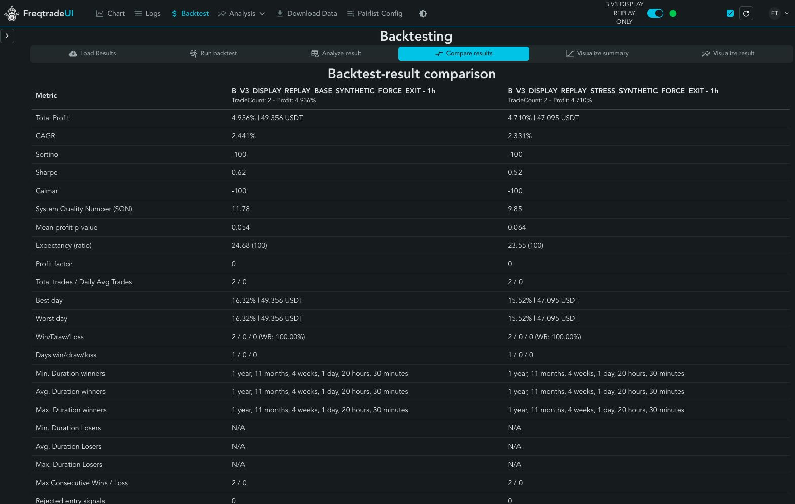

# Issue157：B V3 已有订单的官方 FreqUI 展示

官方Freqtrade2026.7/FreqUI3.1.1页面和历史加载API已实际可用：`http://127.0.0.1:8080/backtest`。base/stress两份标准ZIP/meta均由官方统计/导出器生成，并普通复制到独立展示目录。**这是DISPLAY_REPLAY，不是重新验证信号的完整等价B回测，也不是交易运行。**

在独立预算内各一次原生重建，base1.804秒、stress1.714秒；每场景36笔旧订单gross、price、native cost/cash/realized/amount/open_rate/订单数均精确吻合。原模型、源与旧结果未改，0新行情GET，没有重算84日信号、风险或仓位。首次CLI有一次grant SHA手抄错误，在占位/任何native运行前被拒；纠正后两个实际槽均成功，没有已消费槽重试。

| 口径 | base | stress |
|---|---:|---:|
| 原B模型费用后净变化 USDT | 49.5979614148 | 47.5860384608 |
| 原B模型收益率 | 4.959796% | 4.758604% |
| 原生重建终点前现金 USDT | 1048.7877528154 | 1046.2445917312 |
| 原生重建终点前按原OHLC open估值 | 1049.3573944154 | 1047.0990541312 |
| 官方synthetic force_exit后的余额 | 1049.35615968 | 1047.09534861 |
| 新增展示终点处理的净值影响 USDT | -0.0012347354 | -0.0037055212 |
| FreqUI原生展示净变化 USDT | 49.35615968 | 47.09534861 |
| FreqUI原生展示收益率 | 4.935616% | 4.709535% |
| FreqUI聚合Trade数 | 2 | 2 |
| 原生导出新增终点force_exit订单 | 2 | 2 |
| FreqUI聚合Trade-close DD | 0% | 0% |
| 原B模型可观察小时开盘DD | 3.860325% | 3.857083% |
| 原B真实最大DD | UNKNOWN | UNKNOWN |

原B原生quote-fee账与base-fee模型账并不一致；原模型期末仍有真实残余库存及成本，不改成官方终点清零值。原生终点用各币原始最后小时2022-12-31 23UTC的真实open，没有虚构价格；官方方法模拟卖掉原生残余，未额外叠加最后滑点，不是交易所可执行dust清仓。整体原源覆盖2021-01-01—2023-01-01不含末端；UI因最后真实K线标记显示到2022-12-31 23UTC。

## 截图必须怎样解释

- 官方名称显式包含`B_V3_DISPLAY_REPLAY_BASE_SYNTHETIC_FORCE_EXIT`或STRESS，notes明示来源和限制。
- 旧结果每场景36订单、18资产episode、11个共同活跃区段；原生残余使同币多episode保持同一LocalTrade，故UI聚合为2个Trade，不能人为拆成18个独立交易。
- 两个聚合Trade的胜率、约两年的持仓时长、退出时才跳变的收益曲线、0% DD，均不能解释成B实际全胜/零风险。期内亏损及资金路径被这种聚合隐藏；真实小时MTM模型记录才是对应口径。标准UI没有本项目完整模型净值曲线。
- 策略参数页的`Spot139Native`执行壳参数（例如stoploss=-0.99、空ROI）不是B的84日/ATR/风险控制定义；B决策已体现在冻结订单中。此展示不会证明IStrategy回调等价。
- 原B平均名义/NAV仅约2.19%，2021为正、2022为负；低敞口和开发曝光限制仍成立。20%风险硬要求没有得到新资格。
- USDC仍是独立事件诊断，未包装成原生回测；不能把其EXPAND事件均值与这里的钱包变化放同一排行。

## 工程与追溯

冻结commit467427f；manifest SHA `0b71b888a7fb9d9f58a1afc9057b7d80f0008859d0fe63164b72ce282a6a5399`，执行前评论157#issuecomment-5586339366。两项必要纯合成测试通过，覆盖真实引擎重建/官方export/load和坏摘要/重复执行拒绝。真实执行后原源、原结果、绑定代码SHA逐一复核一致。

- base ZIP SHA `5024feb9a796b0a8d381acda587ff96642774e7a1fcea2777f867168311e9472`。
- stress ZIP SHA `509997a750f11eb944d20ad5ed97465aada3d76a3e5cb81ae2e43c829e45d77d`。
- 详细脱敏终态/meta/保护SHA见`docs/issue157-display-receipt-v1.json`。
- canonical新展示产物root：`/Users/shenjianpeng/.codex/runs/freqtrade-lab/issue157-native-display-v1`。
- 可丢弃官方展示root：`/Users/shenjianpeng/.codex/runs/freqtrade-lab/issue157-frequi-display-v1`。复制官方包+已核官方release ZIP；新本机认证chmod600、不进Git/截图，无真实账户键。只用webserver、127.0.0.1 listener、sandbox禁止外网而允许localhost；未触8011/8012。

已验证页面HTTP200、UI版本3.1.1、历史2条、两个result GET均返回ended，lsof只见loopback listener；监督已实际登录、Load两条、Compare成功，截图见下方。当前Issue保持OPEN；服务结束后可终止此临时PID73991，不影响任何前向任务。展示2次native与旧研究32次分别记账，没有写global或扩大研究预算。

## 实际浏览器验收和复用入口

监督在真实浏览器完成登录、Load两条历史、Compare。截图已检查不含认证信息：



UI钱包指标为N/A：本ZIP没有原生连续钱包捕获，不能把缺失当零。Analyze settings显示Stoploss -99%、protections=false，属于mapper执行载体，绝非B真实ATR止损/风险规则。加载时出现短暂“Strategy not found”：历史报告可读，但当前没有对应完整IStrategy，不能声称已完整接入或直接点击Start backtest。官方两笔聚合交易产生的p-value/Sharpe、Sortino=-100或Profit factor=0也不代表机制统计证据；这些是原生公式在该记录结构上的输出，未人为修补指标。

保持当前服务供用户观看，不自动停止。重启已有可丢弃展示目录（只有原服务停止且8080空闲时执行；命令不含认证值）：

```sh
env -i PATH=/Users/shenjianpeng/.codex/runs/freqtrade-lab/issue-43-profile-driven-v1/venv/bin:/usr/bin:/bin PYTHONPATH=/Users/shenjianpeng/.codex/runs/freqtrade-lab/issue157-frequi-display-v1/lib PYTHONDONTWRITEBYTECODE=1 PYTHONNOUSERSITE=1 TZ=UTC NO_PROXY=127.0.0.1,localhost /usr/bin/sandbox-exec -f /Users/shenjianpeng/.codex/runs/freqtrade-lab/issue157-frequi-display-v1/display.sb /Users/shenjianpeng/.codex/runs/freqtrade-lab/issue-43-profile-driven-v1/venv/bin/python -m freqtrade webserver --no-color -c /Users/shenjianpeng/.codex/runs/freqtrade-lab/issue157-frequi-display-v1/config.json --userdir /Users/shenjianpeng/.codex/runs/freqtrade-lab/issue157-frequi-display-v1/user_data
```

仅重新展示，不再执行已耗尽的两个重建槽。认证只读本次创建的上述0600 config，不复用用户旧secret。原展示进程可通过其前台Ctrl+C结束；重启前先确认端口，不盲杀其他服务。

验证代码可复用的合成命令（不读取市场原文、不改原venv）：

```sh
PYTHONDONTWRITEBYTECODE=1 PYTHONPATH=/Users/shenjianpeng/.codex/runs/freqtrade-lab/issue-43-profile-driven-v1/freqtrade:/Users/shenjianpeng/.codex/runs/freqtrade-lab/issue-43-profile-driven-v1/venv/lib/python3.12/site-packages uv run --python /Users/shenjianpeng/.codex/runs/freqtrade-lab/issue-43-profile-driven-v1/venv/bin/python --with pytest python -m pytest -q -p no:cacheprovider tests/test_issue157_native_display.py
```
