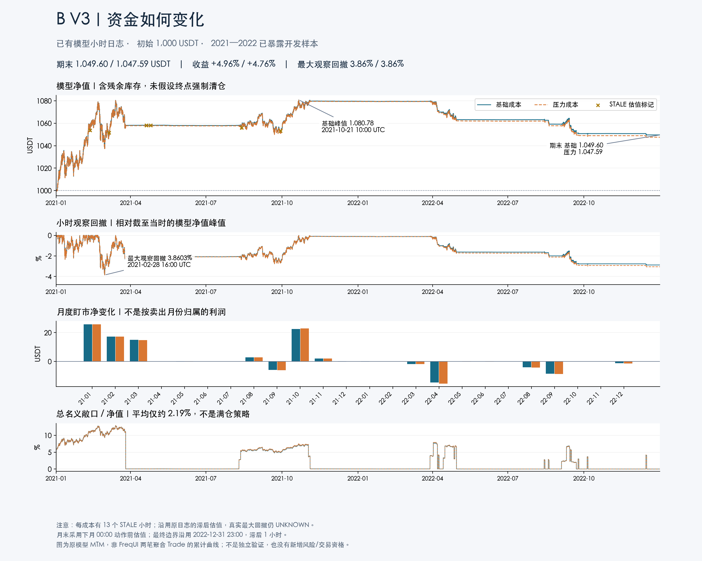

# Issue159：B V3 原模型净值图

已交付中文PNG四联图和独立交互HTML。只读既有SHA绑定日志与原结果；model/native/市场GET均0，没有改冻结代码、原产物、global或grant。图不是FreqUI两笔聚合Trade的退出累计收益。

| 核对项 | 基础成本 | 压力成本 |
|---|---:|---:|
| 小时观察数 | 17520 | 17520 |
| 初始资金 USDT | 1000 | 1000 |
| 期末净值 USDT | 1049.5979614148 | 1047.5860384608 |
| 净变化 USDT | 49.5979614148 | 47.5860384608 |
| 最高模型净值 USDT | 1080.7782079794 | 1080.6294524750 |
| 最大观察回撤 | 3.8603246184% | 3.8570831922% |
| STALE小时 | 13 | 13 |

两成本峰值同为2021-10-21 10UTC，最大观察DD同为2021-02-28 16UTC。净值采用原equity（含残余库存，没有终点强制清仓）。逐行复核cash+inventory×mark与equity；观察DD按此前滚动峰值核对原observed_drawdown。终值与原result的modeled_terminal精确一致。

月MTM复用既有纯聚合函数scripts/analyze_spot139_attribution.py:summarize，没有运行其buyhold或main。月界用此前现金/库存按新月00UTC原mark作动作前估值；最终2023-01-01 00UTC不在日志，沿用末2022-12-31 23UTC，明确1小时carry。24个月净变化求和严格等于期末−1000，不按卖出月份归属利润。敞口含残余库存，平均名义/NAV约2.19%。

STALE标记来自mark_age_hours>0，保留原滞后估值，不补报价；连续模型日志不等于原市场数据无缺口。观察DD不覆盖真实小时内/缺口风险，真实最大DD仍UNKNOWN，用户20%硬要求没有新验证。2021积累、2022回吐与长段低敞口可见，但仍是已暴露Development诊断。

## 文件、复现与验证

- 主PNG：/Users/shenjianpeng/.codex/runs/freqtrade-lab/issue159-model-charts-v1/b-v3-model-overview.png；Git普通副本即上图。
- HTML：/Users/shenjianpeng/.codex/runs/freqtrade-lab/issue159-model-charts-v1/b-v3-model-interactive.html。内嵌Plotly与小时派生图数据，约8.8MiB，无外部script或新服务。避免将整份小时交互数据/绘图库加入仓库，仅本地交付，脚本与SHA入Git。
- base-hourly.jsonl SHA：5da896a1006f6b08c893cbfd9b828fa2bd1e4946c981c00744861de842be1031。
- stress-hourly.jsonl SHA：85e5704ab1838004e460c69cf1c26dec4c4c3f5fdc0ff041e099e4fe3e8b4ec5。
- 完整绝对来源/原结果SHA、月MTM、输出SHA见docs/issue159-model-chart-receipt-v1.json。
- 标准Matplotlib/Plotly，无前端平台。PNG中文/图例/注释/页脚已目视检查，监督独立数值和PNG验收通过。
- 必要检查：前后SHA、17520小时连续性、逐行NAV/DD、终值及月加总。没有为绘图重跑研究或增加无关测试。
- HTML静态检查确认内嵌Plotly、无外部script src。自动浏览器被本地file URL安全策略拒绝，**浏览器交互验证未完成**；未搭HTTP服务/换浏览器绕过。用户可保存并自行打开；不能把静态检查当交互验收。
- FreqUI仍PID73991监听127.0.0.1:8080，ping=pong，未重启。其原生曲线全期近零、终点跳变源于两个聚合Trade，不能替代本图。

复现只重新渲染旧日志，uv临时依赖不改native venv，需要macOS STHeiti字体：

    PYTHONDONTWRITEBYTECODE=1 uv run --with matplotlib==3.11.1 --with plotly==7.0.0 python scripts/plot_issue159_b_model.py

工具校验固定归因manifest SHA，来源漂移则拒绝；数值用Decimal核对，仅绘图坐标转float。渲染更新不代表任何候选重新运行或晋级。
